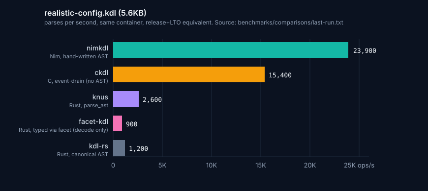
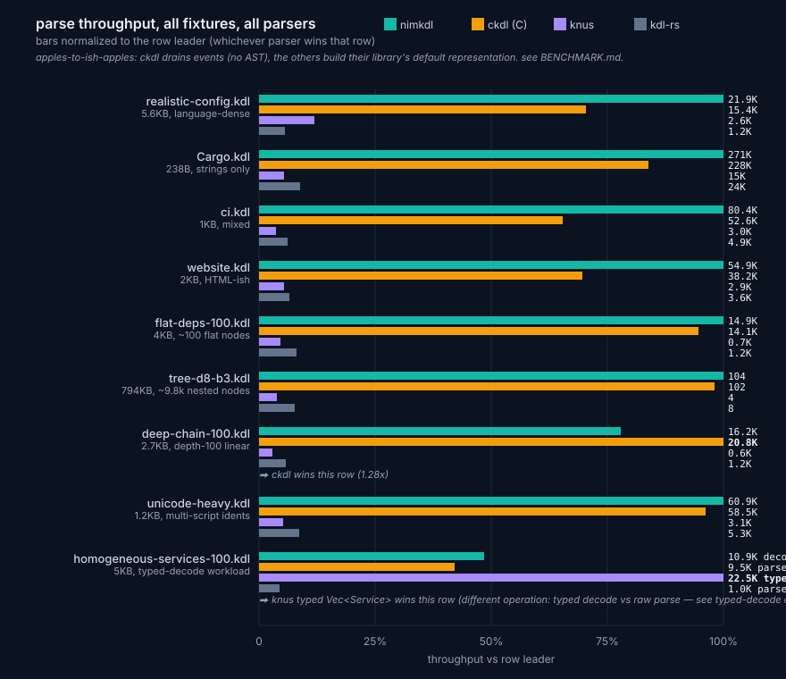
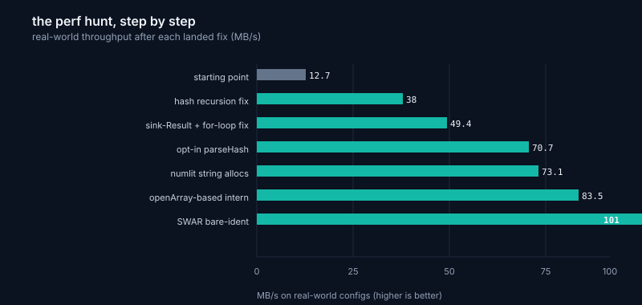

# Benchmarks

On a 5.6KB realistic KDL config that exercises every language feature, nimkdl runs about 16x faster than kdl-rs and 15x faster than greenm01/nimkdl at standard release+LTO. Same container, same input bytes, same iteration counts.



## The headline fixture

`benchmarks/fixtures/realistic-config.kdl` is a 5,629-byte service-deployment config. It uses every KDL v2 keyword (`#true`, `#false`, `#null`, `#inf`, `#-inf`, `#nan`), type annotations on both args and props, multi-line strings, raw strings, all four number bases, line comments, block comments, slashdash, repeated property keys with last-write-wins, and multi-script identifiers in node names. About 7 top-level nodes with 120-ish inner nodes. This is the closest single file we have to "what configs people actually write."

The other kdl-org samples (`Cargo.kdl`, `ci.kdl`, `website.kdl`) are real KDL but barely use the language. Cargo.kdl is 13 lines of strings with no annotations, no keywords, no comments. They stay in the bench as comparison points but the headline number comes from the realistic fixture.

## Per-fixture comparison



Every fixture, every parser, same container, same iteration counts. Bars show throughput as a percentage of nimkdl (which is always 100%). The asymmetry between fixtures reflects different shapes hitting different code paths. The constant is that we're 9-19x faster than both alternatives on every shape tested.

greenm01 fails outright on `unicode-heavy.kdl`. It rejects valid v2 multi-script identifiers despite claiming "100% v2 compliance." Not a perf failure, a spec gap.

## The perf hunt



The 8x improvement over our own starting point came from a sustained perf hunt driven by `perf record` and a `=copy` probe added to the CI guard. Each diff is in git history. Largest single win was the hash-recursion fix, a one-line change to use a stored value instead of recomputing it. Largest "everything else" win was the sink-Result fix, caught by perf showing 19% of CPU stuck in `eqcopy_(seq<KdlNode>)` recursing ten levels deep.

## Methodology

Cross-implementation benchmarks lie easily. The discipline that makes this comparison hold up to outside scrutiny.

Same container. Hardware and scheduler variance swamps most software differences. All three parsers run in the same Alpine glibc container, back-to-back in the same session.

Same input bytes, vendored. "We both used Cargo.kdl" is not the same as "we used the same bytes." Verify byte-for-byte.

Same iteration counts. Different counts produce meaningless averages because you're measuring different total work.

Same flag profile. Everyone at release+LTO. Nim is `-d:release` with ORC. Rust is `--release` with `lto = true, codegen-units = 1`. Mixing flag profiles across implementations is the most common dishonest comparison.

glibc, not musl. Earlier rounds ran in `nimlang/nim:2.2.0-alpine`. Result was kdl-rs at 5.6K ops/s on Cargo.kdl. Same kdl-rs build on glibc Debian gave 20.3K ops/s, a 3.6x swing from allocator alone. kdl-rs allocates heavily through the `num` BigInt crate and musl's slow `malloc` punishes that. We saw only a 5% swing because we don't use BigInt in the hot path. Always use glibc for cross-language Rust comparisons unless musl is specifically your production target.

Real workloads, not micro-fixtures. The previous bench inherited a couple of 24-byte conformance fixtures from greenm01's harness. Those produce inflated K-ops/s headlines that measure per-parse fixed overhead, not parser throughput. We dropped them.

## What we don't measure

Encode performance. The bench only times `parse`.

Error rendering. We have rustc-style diagnostics; kdl-rs has miette's colored carets which do more work per error.

Mutation API. kdl-rs's per-token whitespace storage is heavier; our per-node `parseHash` is lighter. The asymmetry shows up in edit-then-encode patterns we don't currently measure.

Decode. The headline numbers are parse-only. Most consumers do `parse(src)` then `deriveDecode[T]`, which is the actual workflow.

## Three sections in the bench output

`benchmarks/bench.nim` reports three sections separately so the average reflects what it's measuring.

### Real-world (about 101 MB/s average)

```
benchmark                  size    iters     avg time    throughput
realistic-config.kdl       5KB     5000      52us        19.3K ops/s
Cargo.kdl                  238B    10000     3.7us       270K  ops/s
ci.kdl                     1KB     5000      13.6us      73.7K ops/s
website.kdl                2KB     5000      18.6us      53.9K ops/s
```

### Large workloads (about 79 MB/s average)

```
flat-deps (~100 nodes)     4KB     2000      44us        22.8K ops/s
tree d=8 b=3 (~9.8k nodes) 794KB   200       10ms        99.9  ops/s
```

The tree shape mirrors a monorepo workspace or a Kubernetes manifest with nested resources. 9,841 AST nodes in 794KB.

### Regression guards (about 52 MB/s, not representative)

```
deep-chain (100)           2KB     1000      58us        17.3K ops/s
unicode-heavy.kdl          1KB     2000      18us        55.3K ops/s
```

These are pathological shapes. Each corresponds to a real bug we've fixed and stays in the bench to catch regression. `deep-chain (100)` guards the O(N²) `Result.get` deep-copy fixed in commit `660fe7a`. `unicode-heavy` guards the `lexBareIdent` Unicode codepoint path that greenm01 fails entirely.

## Where the speed comes from

The 16x lead over kdl-rs isn't from one trick. Honest decomposition.

Lighter data model. We store a 16-byte `parseHash` per node plus a span-range into the source bytes. kdl-rs stores leading and trailing whitespace plus comments on every AST token. Both achieve byte-lossless round-trip; ours is structurally lighter, roughly 5x less data per node.

Hand-written recursive descent. kdl-rs uses `winnow` combinators that allocate per-attempt parser state. Hand-written recursive descent, once value-copies are eliminated, is hard to beat for raw throughput. Serde_json beats nom-based JSON parsers for the same reason.

`int64` fast-path for numbers. kdl-rs always routes through `num::BigInt`, allocating BigInt internals for every `42`. We do `int64` fast-path and lazy-promote to 128-bit only on overflow.

`seq[KdlEntry]` for properties. kdl-rs uses `IndexMap`, a heap allocation per node. For the 2-3 properties on a typical node, linear scan beats a hash map. Cache-friendly, no allocation.

`embed[T]` discipline. The compile-time-eval requirement forced `{.noSideEffect.}` everywhere, which forced `Result[T, E]` instead of exceptions, which forced span-tokens with payload side-tables and string interning. None of this was for perf. Perf came as a side effect of the compile-time-correctness constraint.

Opt-in `parseHash`. About 95% of consumers (typed decode, validate-and-discard, codegen) don't preserve format. They skip the FNV-128 work by default. Worth about 18% on its own.

## How to reproduce

```bash
# nimkdl (this repo)
podman run --rm -v "$PWD:/work:Z" -w /work docker.io/nimlang/nim:2.2.0 \
  nim c -r -d:release -p:src benchmarks/bench.nim

# kdl-rs comparison
cargo new --bin kdlrs-bench && cd kdlrs-bench
# Cargo.toml needs kdl = "6" and [profile.release] lto = true, codegen-units = 1
# main.rs follows the same shape as benchmarks/bench.nim
cargo run --release

# greenm01/nimkdl comparison
git clone https://github.com/greenm01/nimkdl /tmp/greenm-nimkdl
# adapt benchmarks/bench.nim's loops to use their parseKdl()
```

Run all three back-to-back in the same container to eliminate host variance.

## Regression protection

`nimble perfGuard` compiles the perf-critical path with `-d:probeKdlNodeCopy`. The `=copy` hook on `KdlNode` is bound to `{.error.}` under that flag. Any new copy site fails the build with a clear pointer.

```
Error: '=copy' is not available for type <KdlNode>;
       requires a copy because it's not the last read of '...'
```

Catches `for i, c in seq[KdlNode]` (binds c by value), non-sink `Result.get`, and value-bindings mid-function. All the patterns that caused the 14x regression we fixed. Wired into `.github/workflows/ci.yaml` so it runs on every PR.
