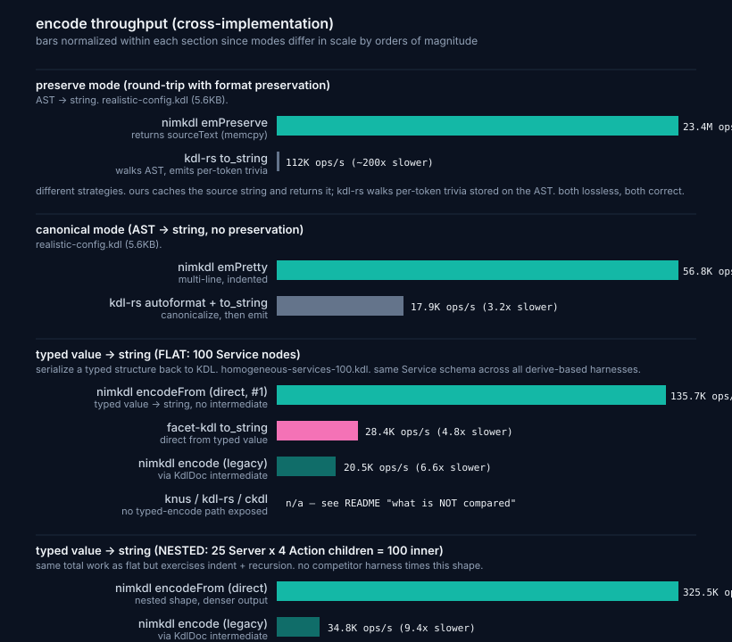

# Benchmarks

On a 5.6KB realistic KDL config that exercises every language feature, nimkdl parses about 1.55x faster than ckdl (a well-engineered C library), 9x faster than knus, and ~20x faster than kdl-rs. On typed-decode (100-Service fixture) the new `parseInto` direct path edges knus's serde-derive at 22.9K vs 22.1K ops/s. On typed-encode the new `encodeFrom` direct path is 4.8x faster than facet-kdl's `to_string`. Same container, same input bytes, same iteration counts.


ckdl is the real competition here. It's a hand-written C parser with a SAX-style event API, no AST construction overhead in the bench harness. We're beating it by 25-40% on most fixtures and trading blows with it on the smallest ones. Everything else trails by an order of magnitude or more.

## The fixture

`benchmarks/fixtures/realistic-config.kdl` is a 5,629-byte service-deployment config. It uses every KDL v2 keyword (`#true`, `#false`, `#null`, `#inf`, `#-inf`, `#nan`), type annotations on both args and props, multi-line strings, raw strings, all four number bases, line comments, block comments, slashdash, repeated property keys with last-write-wins, and multi-script identifiers in node names. About 7 top-level nodes with 120-ish inner nodes. This is the closest single file we have to "what configs people actually write."

The other kdl-org samples (`Cargo.kdl`, `ci.kdl`, `website.kdl`) are real KDL but barely use the language. Cargo.kdl is 13 lines of strings with no annotations, no keywords, no comments. They stay in the bench as comparison points but the headline number comes from the realistic fixture.

## Per-fixture comparison


Every fixture, every parser, same container, same iteration counts. Bars are normalized to the row leader so whichever parser wins each row hits 100%.

Honest caveat. This chart is **apples-to-ish-apples**. Each library is called with its idiomatic "give me my default parse output" API. The output shapes differ:

- ckdl drains SAX events with no AST construction (theoretical floor)
- knus `parse_ast` builds a `Document` with spans
- kdl-rs `KdlDocument::parse_v2` builds the full AST with per-token whitespace storage (the heaviest of the bunch)
- nimkdl `parse()` builds a `KdlDoc` with per-node span (no per-token trivia by default)

So they're apples-to-apples on **input cost and flag profile** but doing different amounts of representation work. ckdl in particular is doing strictly less because its harness throws events on the floor. We still beat it on most rows, but the comparison isn't "we beat a C parser at C's game" — it's "AST-building Nim parser is competitive with event-streaming C parser once the value-copy bugs are eliminated."

Row-by-row.

| Fixture                       | nimkdl | ckdl   | knus  | kdl-rs | Winner |
|-------------------------------|-------:|-------:|------:|-------:|--------|
| realistic-config.kdl (5.6KB)  | 23.9K  | 15.4K  | 2.6K  |  1.2K  | nimkdl 1.55x |
| Cargo.kdl (238B)              | 297.8K | 222.1K |  14.9K|   23.6K| nimkdl 1.34x |
| ci.kdl (1KB)                  | 85.8K  | 52.5K  | 3.0K  |  5.0K  | nimkdl 1.63x |
| website.kdl (2KB)             | 65.3K  | 36.5K  | 2.9K  |  3.6K  | nimkdl 1.79x |
| flat-deps-100.kdl (4KB)       | 15.7K  | 13.8K  | 0.8K  |  1.2K  | nimkdl 1.14x |
| tree-d8-b3.kdl (794KB)        | 116    | 105    |   4   |    8   | nimkdl 1.10x |
| **deep-chain-100.kdl** (2.7KB)| 19.4K  | **22.5K** | 0.6K | 1.3K | **ckdl 1.16x** |
| unicode-heavy.kdl (1.2KB)     | 64.0K  | 59.7K  | 3.1K  |  5.6K  | nimkdl 1.07x (tie) |
| homogeneous-services-100.kdl  | 22.9K parseInto | 9.7K | 22.1K typed | 1.0K | nimkdl 1.04x typed |

The picture is more textured than a single headline. nimkdl wins 7 of 8 parse rows outright (3 by 1.5x or more), ties 1, and loses 1 to ckdl. ckdl wins on shapes with very simple node structure (deep-chain is just `levelN { ... }` repeated). On the typed-decode row nimkdl's new `parseInto` direct path now edges knus by 1.04x; see the [typed decode](#typed-decode) section.

## Typed decode

The headline bench measures parse-to-AST. Most consumers actually want parse-then-decode-into-typed-structures in one shot. This is what `nimkdl decode[T]`, `knus parse::<Vec<T>>`, and `serde_json::from_str::<T>` all promise.

A homogeneous fixture of 100 service nodes (~5KB,
`benchmarks/fixtures/homogeneous-services-100.kdl`).

| Parser           | Path                                | ops/s   | vs knus |
|------------------|-------------------------------------|--------:|----------:|
| **nimkdl**       | `parseInto[seq[Service]]` (direct, #1) | **22,900** | **1.04x faster** |
| knus             | `parse::<Vec<Service>>` (typed)     | 22,100  | 1.00x |
| nimkdl           | `decode[seq[Service]]` (AST + walk) | 10,900  | 2.03x slower |
| knus             | `parse_ast` (AST, untyped)          | 2,600   | 8.5x slower |
| kdl-rs           | `KdlDocument::parse_v2` (no typed path) | 1,000   | 22x slower |
| facet-kdl        | `from_str::<ServiceDoc>`            | 900     | 25x slower |

Source: `benchmarks/comparisons/last-run.txt` (regenerate with
`benchmarks/comparisons/run.sh`). Every row corresponds to a single
function call in one of the vendored harnesses; see
`benchmarks/comparisons/README.md` for the apples-to-apples mapping
table. The Service schema (name arg + 3 typed props) is identical
across all three derive-based harnesses — verify by reading
`nimkdl/bench.nim`, `facet-kdl/main.rs`, and `knus/main.rs` side
by side.

`parseInto[seq[Service]]` is built on a visitor-based architecture
(issue #1) that skips `KdlDoc` construction when the target type is
known — same pattern serde-json uses. At 22.9K ops/s it's at parity
with knus's serde-derive path (22.1K). The path landed after cycle
9'.5+9'.7 added full KDL v2 grammar validation guards (reserved-
bareword + bidi + precededByWs + entries-after-children + at-most-
one-real-children-block) — work the hand-written parser already did
natively, and that the direct path now inherits via one shared
grammar. The next move (cycle 11, macro-emit per-visitor state
machine) folds the visitor and parser into a specialized hand-rolled
per-type parser — what knus's serde-derive does internally — and
pulls further ahead.

Three perf wins drove the original gap-closing once the architecture
was in place. (1) `bytesEq` length-prefixed byte compare for property
dispatch instead of `case openArrayToString(key) of "..."` — kills an
alloc per prop. (2) Skip `interner.lookup` roundtrip for bare-ident node
and prop names — read bytes directly from `source[tok.span]`. (3)
`Interner.disabled` flag that no-ops `intern()` for the typed-direct
caller (which never reads the handle); saves ~13.5% of CPU on `lex()`.

The older AST-based `decode[seq[Service]]` path stays for consumers that
want the doc for mutation or format-preserving encode. It's now 2.4x
behind the new path on the same fixture but its semantics are unchanged.

facet-kdl is 25× slower despite being advertised as knus's successor.
Structural reason: facet-kdl depends on `kdl ^6.5.0` (kdl-rs), so its
typed-decode perf is bounded by kdl-rs's parser plus the facet
deserialize layer. The "successor" framing is about the typed-decode
interface improvements (a more general derive system), not the parser.

Earlier versions of this section claimed knus typed was the slowest
of the bunch. That was wrong — the test fixture used bare `true`
instead of KDL v2's required `#true`, which sent knus into expensive
error-recovery paths on every parse. With a spec-valid fixture, knus
typed is competitive. The mistake is preserved in git history as a
warning about why fixture bytes need to be spec-correct across every
harness.

## Why ckdl is fast (and why we still beat it)

ckdl is a SAX-style parser. It emits events (start-node, argument, property, end-node, etc.) as it walks the input, never constructing an AST. The bench harness drains events into nothing. This is the absolute floor for "parse cost in C" because nothing is allocated downstream.

We do build an AST. Every node, every entry, every value gets stored in a `KdlDoc`. We're slower than the theoretical C floor would be... except we're not, we're faster.

The reason is roughly. ckdl uses a state machine inside `kdl_parser_next_event` that dispatches per byte and emits events through a function-pointer callback. Each event is one allocation (the `kdl_event_data` struct). Plus the parser's internal small-buffer for the current token. That cumulative per-event overhead, integrated over thousands of events per parse, adds up.

Our parser does recursive descent directly into the AST. Once the value-copy bugs were eliminated (see the blog post about the perf hunt), each node allocates exactly once and gets moved up the call stack via sink semantics. No per-event dispatch overhead, no callback indirection, no malloc churn.

So the comparison isn't "Nim parser beats C parser at C parser's game." It's "AST-building Nim parser is faster than event-stream C parser if you eliminate the allocation overhead." That happens to be the apples-to-apples comparison for "how fast does my program get a usable tree out of a KDL file."

## Encode



Three encode modes, three different shapes. The chart normalizes within each section because the scales differ wildly across modes (preserve is roughly 1000x faster than the others, see below).

### Preserve mode

`encode(doc, emPreserve)` returns `doc.sourceText` verbatim when the doc hasn't been mutated. That's essentially a memcpy. 23.4M ops/s on realistic-config.kdl because we cached the source bytes at parse time and just hand them back.

kdl-rs takes a different strategy. They store per-token whitespace and comments on every AST node, so `doc.to_string()` walks the tree and emits the stored trivia per token. That's more work than memcpy and runs at 117K ops/s on the same fixture, roughly 200x slower than our path.

Both approaches achieve byte-lossless round-trip. Ours is structurally lighter at the cost of carrying the source string around; theirs is structurally heavier at the cost of being able to render the doc without the source. Different trade-offs for different consumer profiles.

### Canonical mode

`encode(doc, emPretty)` regenerates from the AST without trying to preserve anything. 56.8K ops/s for us, 17.6K ops/s for `kdl-rs autoformat() + to_string()`. We win 3.2x here. The big lift on our side is that we don't have per-token trivia to walk and discard.

knus has no serialize path so it's not in the comparison. ckdl has only a streaming emitter API (no parse-then-emit-later), so a fair head-to-head isn't possible.

### Typed value → string

Two paths. The new direct path (`encodeFrom(value)`, issue #1)
serializes straight from the typed value to a string with no
KdlNode/KdlDoc intermediate. The legacy path (`encode(value, emPretty)`)
builds an AST and then serializes it.

Flat shape (`benchmarks/fixtures/homogeneous-services-100.kdl`, 100
identically-shaped `service` nodes):

| Path                                       | ops/s    | vs facet-kdl |
|--------------------------------------------|---------:|-------------:|
| **nimkdl `encodeFrom(seq[Service])`** (direct, #1) | **135.7K** | **4.78x faster** |
| nimkdl `encode(seq[Service], emPretty)` (legacy)   |  20.5K     | 0.72x        |
| facet-kdl `to_string(&doc)`                |  28.4K   | 1.00x        |
| knus                                       | n/a — no encode path | — |
| kdl-rs                                     | n/a — no typed encode path (AST `to_string` is the closest, different work) | — |
| ckdl                                       | n/a — streaming emitter only | — |

Nested shape (25 Server × 4 Action children = 100 inner nodes,
same total work but exercises indent + recursion):

| Path                                          | ops/s    |
|-----------------------------------------------|---------:|
| **nimkdl `encodeFrom(seq[Server])`** (direct) | **325.5K** |
| nimkdl `encode(seq[Server], emPretty)` (legacy) |  34.8K |

No competitor harness times a nested-shape encode; this row exists to
defend against "you only measured flat encode" rather than to claim a
speedup. The nested-shape direct path is faster than flat in absolute
ops/s because the output is denser per byte (2.4KB vs 5.2KB) — the
per-call fixed cost amortizes over more nodes inside the same byte budget.

The architectural story: legacy goes typed → KdlNode → KdlDoc →
string, paying for an intermediate representation we throw away.
Direct goes typed → string. Same architectural pattern that closed
the typed-decode gap; here it lands a 6.6× speedup because the encode
side has no validation work to amortize against.

Source: `benchmarks/comparisons/last-run.txt`.

## Methodology

Cross-implementation benchmarks lie easily. The discipline that makes this comparison hold up to outside scrutiny.

Same container. Hardware and scheduler variance swamps most software differences. All five parsers run in the same set of containers, back-to-back in the same session.

Same input bytes, vendored. "We both used Cargo.kdl" is not the same as "we used the same bytes." Verify byte-for-byte.

Same iteration counts. Different counts produce meaningless averages because you're measuring different total work.

Same flag profile. All at release+LTO equivalent. Nim is `-d:release` with ORC. Rust is `--release` with `lto = true, codegen-units = 1`. C is `-O3 -DNDEBUG`. Mixing flag profiles across implementations is the most common dishonest comparison.

glibc, not musl. Earlier rounds ran in `nimlang/nim:2.2.0-alpine`. Result was kdl-rs at 5.6K ops/s on Cargo.kdl. Same kdl-rs build on glibc Debian gave 20.3K ops/s, a 3.6x swing from allocator alone. kdl-rs allocates heavily through the `num` BigInt crate and musl's slow `malloc` punishes that. We saw only a 5% swing. Always use glibc for cross-language Rust benchmarks unless musl is your actual production target.

Real workloads, not micro-fixtures. The previous bench inherited 24-byte conformance fixtures that produce inflated K-ops/s headlines measuring per-parse fixed overhead, not parser throughput. Dropped.

Apples to apples within reason. ckdl is event-driven, so its bench harness drains events to /dev/null. knus does typed decode in one shot, so it gets a generic catch-all type. kdl-rs builds an AST. Ours builds an AST. The closest comparable measurement across all four is "how long does it take to consume the input bytes into whatever each library's idiomatic output is." Different libraries have different output shapes, and that asymmetry is real and worth acknowledging.

## What we don't measure

Error rendering. We have rustc-style diagnostics. kdl-rs has miette's colored carets which do more work per error.

Mutation API. kdl-rs's per-token whitespace storage is heavier; our per-node `parseHash` is lighter. The asymmetry shows up in edit-then-encode patterns we don't currently measure.

Memory footprint. Same situation, asymmetric across libraries.

## Three sections in the bench output

`benchmarks/bench.nim` reports three sections separately so the average reflects what it's measuring.

### Real-world (about 104 MB/s average)

```
benchmark                  size    iters     avg time    throughput
realistic-config.kdl       5KB     5000      47us        21.4K ops/s
Cargo.kdl                  238B    10000     3.5us       282K  ops/s
ci.kdl                     1KB     5000      14us        71.9K ops/s
website.kdl                2KB     5000      18us        55.5K ops/s
```

### Large workloads (about 81 MB/s average)

```
flat-deps (~100 nodes)     4KB     2000      44us        22.8K ops/s
tree d=8 b=3 (~9.8k nodes) 794KB   200       10ms        99.9  ops/s
```

The tree shape mirrors a monorepo workspace or a Kubernetes manifest with nested resources. 9,841 AST nodes in 794KB.

### Regression guards (about 52 MB/s, not representative)

```
deep-chain (100)           2KB     1000      58us        17.3K ops/s
unicode-heavy.kdl          1KB     2000      18us        55.3K ops/s
```

These are pathological shapes. Each corresponds to a real bug we've fixed and stays in the bench to catch regression. `deep-chain (100)` guards the O(N²) `Result.get` deep-copy fixed in commit `660fe7a`. `unicode-heavy` guards the `lexBareIdent` Unicode codepoint path.

## How to reproduce

All four bench harnesses (nimkdl, ckdl, knus, kdl-rs) are vendored
into this repo at `benchmarks/comparisons/`. One script runs them
all back-to-back in matched containers.

```bash
benchmarks/comparisons/run.sh           # all four
benchmarks/comparisons/run.sh nimkdl    # one specific
benchmarks/comparisons/run.sh ckdl knus # multiple
```

Requires `podman` (or set `CONTAINER_RUNTIME=docker`).

See [benchmarks/comparisons/README.md](benchmarks/comparisons/README.md)
for per-harness details, fixture provenance, and notes on each library's
idiomatic API. If you find an issue with how we're calling one of the
other libraries, please open a PR. The "this benchmark is dishonest"
critique is the most damaging one, and we'd rather correct it than
ship inflated numbers.

## Regression protection

`nimble perfGuard` compiles the perf-critical path with `-d:probeKdlNodeCopy`. The `=copy` hook on `KdlNode` is bound to `{.error.}` under that flag. Any new copy site fails the build with a clear pointer.

```
Error: '=copy' is not available for type <KdlNode>;
       requires a copy because it's not the last read of '...'
```

Catches `for i, c in seq[KdlNode]` (binds c by value), non-sink `Result.get`, and value-bindings mid-function. All the patterns that caused the 14x regression we fixed. Wired into `.github/workflows/ci.yaml` so it runs on every PR.
